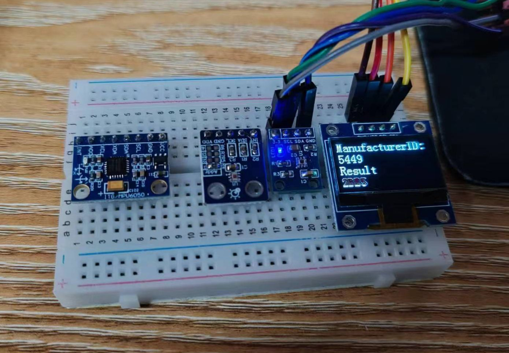

| **OPT3002 light sensor** |  |
|----------|----------|
|    | **OPT3002 light sensor** Acquire the data of the OPT3002 chip |

# Description

MCU: stm32f103c8t6

External module:  Board that I drew for encapsulate this chip; 0.96 OLED

Code with Keil.

The test was as following. You can use this module to read the strength of the light. The unit is lx.

<video controls src="images/opt3002.mp4" title="Title" autoplay = "autoplay"></video>

The total cost of this work: process of self-made board costs ￥20, the stm32 MCU costs ￥10. 

The PCB is like 

I just connect the SCL and SDA through a resistance to 3v3 power supply, and other components are as the technological manal recommended.

